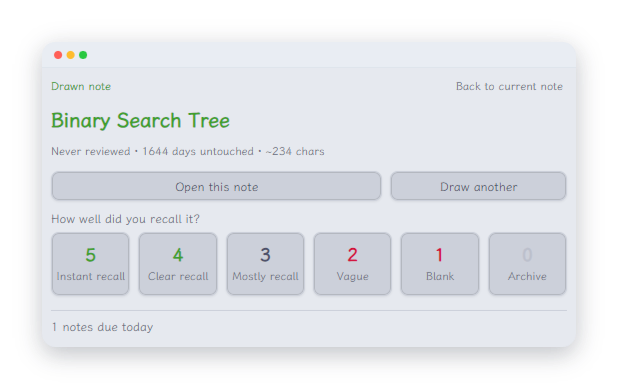

# Spaced Dive

**English** · [简体中文](#简体中文)

**Review whole notes on a forgetting curve — no flashcards, no rewriting.**

Spaced Dive draws one note out of your vault, puts it in the sidebar, and asks what you remember. You read it, you rate it, it comes back later. It's built for the vault you've been writing for years and almost never reopen.



---

## What it does

Spaced Dive treats **one note as one memory unit**.

Every so often it picks a note and shows it to you in the sidebar: where it lives, how long it's been untouched, how many times you've reviewed it. You read it, recall what it's about, and give it a score from 0 to 5. That score decides when you see it again.

Nothing else changes. Your notes stay your notes — the plugin only adds a few fields to the frontmatter.

## Why not flashcards

Card-based plugins ask you to carve your knowledge into question-and-answer pairs up front. That's a real cost, and it's why most people quit spaced repetition: all the work is at the beginning and all the payoff is at the end.

Spaced Dive flips that. Your notes are already the units. The only thing you do is read and rate.

| | Spaced Dive | Card-based plugins |
| --- | --- | --- |
| Unit of review | A whole note | Q&A pairs inside notes |
| Do you rewrite your notes | No | Yes |
| What gets picked | Overdue × times reviewed × **folder balance** × **explore rate** | Whatever is due next |
| Folder balance | Yes | Usually no |
| Explore rate | Yes | Usually no |

Folder balance and explore rate are for **big, messy vaults**. With fifty notes they're noise. With two thousand notes across a dozen subjects, they're the difference between "helping me remember" and "showing me the same corner of the vault over and over".

## How a note gets picked

Four things decide it:

1. **How overdue it is.** A note due three weeks ago beats one due today.
2. **How many times you've seen it.** Well-worn notes are pushed down — they don't need you as much.
3. **Folder balance.** Notes from folders you've drawn from recently are damped. This is what stops three days in a row landing on the same directory.
4. **Explore rate.** A share of draws deliberately ignore the due list and go looking for notes you've never reviewed. Default 30%.

Rule of thumb: explore rate `0` is a pure review queue, `1` is pure exploration.

## Install

**From the community directory**

Settings → Community plugins → Browse → search **Spaced Dive**.

**Manually**

Download `main.js`, `manifest.json` and `styles.css` from [Releases](https://github.com/6iedog/obsidian-spaced-dive/releases), put them in `<vault>/.obsidian/plugins/spaced-dive/`, restart Obsidian, then enable the plugin in Settings → Community plugins.

Works on desktop and mobile. Requires Obsidian **1.8.7** or later.

## Day to day

Three ways in:

- **Dice button** in the left ribbon — one click draws a note.
- **Status bar** at the bottom — shows how many notes are due today. Click it to draw.
- **Command palette** (Ctrl/Cmd + P) — search `Spaced Dive`.

Four commands:

- **Draw a note to review** — draws, and puts the result in the sidebar
- **Open review panel** — opens the panel without drawing
- **Show review stats** — how many notes in total, how many reviewed, how many due today
- **Clear review record of current note** — sends a note back to "never reviewed"

You can also **right-click** any note in the file list for *Clear this note's review record*.

## A review, start to finish

The result lands **in the sidebar, not in a modal**. That's deliberate:

1. Click the dice → the sidebar shows what you drew: path, folder, review state, size. **It does not jump to the note.**
2. Click **Open this note** → the note opens in the main pane, the sidebar stays put.
3. Read, think it through, come back and click a score → recorded, and the panel tells you when you'll see it next.

Not auto-jumping matters: the panel should let you see what you drew before you decide to read it.

A modal can't do this. It's blocking, so you can't read the note while it's open, and dismissing it throws the draw away. The result has to live somewhere **persistent but not focus-stealing**.

## Scoring

| Score | Meaning | Effect |
| --- | --- | --- |
| 5 | I know this cold | +1 step |
| 4 | I remember it well | +1 step |
| 3 | I mostly remember | no change |
| 2 | Hazy, about half right | −2 steps |
| 1 | Couldn't recall it | −2 steps |
| 0 | Not worth keeping | archived — never drawn again |

The interval ladder is in days: `1, 3, 7, 16, 35, 90, 180, 365, 730`. You can edit it in settings.

## Where your data lives

By default, review state is written into **each note's own frontmatter**, so it travels with the note.

| Field | Meaning |
| --- | --- |
| `sr-added` | When the note joined the pool — frozen from its modification time at that moment |
| `sr-due` | Next due date |
| `sr-step` | Position on the interval ladder |
| `sr-times` | Total reviews |
| `sr-last` | Date of the last review |
| `sr-quality` | Last score |
| `sr-ease` | Ease factor (reserved) |
| `sr-skip` | `true` means never draw this again |

The `sr-` prefix is deliberate. Early plugins in this space used bare field names like `due` and `interval` and collided with every other plugin in the vault. **Don't change the prefix** — existing records won't be found under a new one.

If you'd rather the plugin didn't touch your notes at all, switch **storage mode** to "Plugin data file". The cost: renaming a note orphans its record, and Dataview can't see it.

### Query it with Dataview

````dataview
TABLE sr-due AS Due, sr-times AS Times, sr-step AS Step
FROM ""
WHERE sr-due AND date(sr-due) <= date(today)
SORT sr-due ASC
````

Obsidian 1.9+ Bases reads these fields as columns directly — nothing extra to install.

## Settings worth knowing

The settings panel has six groups: scope, filters, schedule, picking, storage, interface. The ones that actually change how it feels:

- **Scope mode** — whole vault, specific folders, or tagged notes only. In a large vault, narrow it.
- **Where notes open** — current tab (skips pinned tabs) / new tab / split. Pick one of the latter two if you don't want your reading interrupted.
- **Explore rate** — 0 is pure review, 1 is pure exploration. Default `0.3`.
- **Folder decay factor** — closer to `0` damps recently drawn folders harder, spreading draws more evenly.
- **Stub threshold** — very short notes are down-weighted. Turn on *Drop stubs entirely* to exclude them instead.
- **Daily limit** — maximum draws per day; `0` means no limit.
- **Interface language** — follow Obsidian, or force English / 简体中文.
- **Dry run** — runs the whole flow without writing a single field. Worth leaving on for a few rounds to see what it picks before it touches anything.

## Language

The interface ships in **English** and **简体中文**, and follows your Obsidian language by default (through the official `getLanguage()` API).

Because that API requires it, the minimum app version is **1.8.7**.

## Use it from an AI assistant

The plugin is for you. There's also a command-line version for AI assistants — Claude Code, WorkBuddy, and similar — so your assistant can draw from the same pool.

It's a single self-contained file, needs no build step, and **doesn't require Obsidian to be running**. Both entry points share the exact same picking rules and the same `sr-*` progress, so a note reviewed in one is known to the other.

Grab it from [`./skills/spaced-dive/`](./skills/spaced-dive/) — the README in that folder covers installation.

## Privacy

- **No network calls.** Nothing is uploaded, there's no telemetry and no account.
- The plugin reads and writes notes inside the current vault, plus its own `data.json`.
- It never collects note content, file names, or any personal information.

## Design notes

- **One source of truth for progress.** Scheduling data lives in note frontmatter, not in a private database. Rename a note and the record follows it.
- **One source of truth for rules.** The plugin and the command-line version share the same filtering and scheduling code — they can't disagree.
- **Atomic writes.** Frontmatter is modified through `FileManager.processFrontMatter`, so it won't race with other plugins editing the same note.
- **Reads scale.** Only metadata Obsidian already caches is used — the plugin never re-reads your whole vault to draw one note.

## Development

```bash
npm install
npm run dev       # watch mode, builds main.js
npm run build     # typecheck + minified build (+ deploy to a local vault, if found)
npm run lint      # the ESLint setup the community review uses
npm test          # scheduling, filtering, frontmatter round-trips
npm run test:cli  # the same, for the command-line entry point
npm run ship      # all of the above, then build both artifacts
```

`npm run lint` loads
[`eslint-plugin-obsidianmd`](https://github.com/obsidianmd/eslint-plugin)'s
recommended config — the rules the community review applies — plus type-aware
checks, so it catches things `tsc` alone won't. It runs as part of
`npm run ship`.

`npm run build` copies `main.js`, `manifest.json` and `styles.css` into a local
vault. It looks the vault up automatically (see `skills/spaced-dive/README.md`
for the order it tries) and only warns if it can't find one, so a plain clone
still builds.

`main.js` is **not** committed — it's gitignored, as in the official plugin
template, and ships as a release asset. The command-line build,
`skills/spaced-dive/spaced-dive.cjs`, *is* committed, because the skill reads it
straight out of the repository.

## Releasing

Version numbers are driven by npm:

```bash
npm version patch        # or minor / major
```

That bumps `package.json`, and `version-bump.mjs` then copies the new number
into `manifest.json` and records it in `versions.json`.

Push the commit and the tag, then attach `main.js`, `manifest.json` and
`styles.css` to a GitHub release. The tag has to match the version now in
`manifest.json` **exactly** — the community directory matches them literally.

## License

MIT — see [LICENSE](./LICENSE).

<br>

---

# 简体中文

**按遗忘曲线复习整篇笔记 —— 不用做卡片，不用改写。**

Spaced Dive 从你的库里抽出一篇笔记，放进侧边栏，然后问你：还记得什么？你读一遍、打个分，它过些日子再来。它是为那种「写了一千多篇，但八成再没打开过」的库做的。


---

## 它做什么

Spaced Dive 把**一篇笔记当作一个记忆单元**。

隔一阵子它挑出一篇，在侧边栏给你看：在哪个目录、多久没碰过了、复习过几次。你读一遍，回想它讲了什么，然后给一个 0 到 5 的分数。这个分数决定下次什么时候再见到它。

除此之外什么都不变。笔记还是你的笔记 —— 插件只往头部加几个字段。

## 为什么不做卡片

卡片式插件要求你先动手把知识剁成问答对。这是笔实实在在的成本，也是大多数人放弃间隔重复的原因：活儿全在开头，回报全在结尾。

Spaced Dive 把它倒过来。你的笔记本身就是单元，你要做的只有「读」和「打分」。

| | Spaced Dive | 卡片式插件 |
| --- | --- | --- |
| 复习单位 | 整篇笔记 | 笔记里挖空的问答对 |
| 需要改造笔记吗 | 不用 | 要 |
| 抽谁 | 逾期度 × 复习次数 × **分区平衡** × **探索率** | 按到期日排队 |
| 分区平衡 | 有 | 通常没有 |
| 探索率 | 有 | 通常没有 |

分区平衡和探索率是给**大而杂的库**准备的。只有五十篇笔记时它们是噪音；有两千篇横跨十几个学科的笔记时，它们决定了这套系统是"帮你回忆"，还是"让你反复撞见同一片区域"。

## 一篇笔记是怎么被选中的

四件事决定：

1. **逾期多久。** 三周前就该复习的，赢过今天才到期的。
2. **你复习过几次。** 见得太多的笔记会被压下去 —— 它们没那么需要你。
3. **分区平衡。** 最近抽过的分区会被降权。这就是"连着三天不落同一个目录"的原因。
4. **探索率。** 有一部分抽卡会故意跳过到期清单，去翻你从没复习过的笔记。默认 30%。

一句话记法：探索率 `0` 是纯复习队列，`1` 是纯开荒。

## 安装

**从社区插件市场**

设置 → 第三方插件 → 浏览 → 搜索 **Spaced Dive**。

**手动安装**

从 [Releases](https://github.com/6iedog/obsidian-spaced-dive/releases) 下载 `main.js`、`manifest.json`、`styles.css`，放进 `<库>/.obsidian/plugins/spaced-dive/`，重启 Obsidian，然后在「设置 → 第三方插件」里启用。

桌面端和移动端都能用。需要 Obsidian **1.8.7** 或更高。

## 日常怎么用

三种入口：

- **左侧栏骰子按钮** —— 点一下直接抽卡。
- **底部状态栏** —— 显示今天有多少篇该复习了，点它也是抽卡。
- **命令面板**（Ctrl/Cmd + P）—— 搜 `Spaced Dive`。

四条命令：

- **抽取一篇笔记复习** —— 抽卡，结果送进侧边栏
- **打开复习面板** —— 只开面板，不抽卡
- **显示复习统计** —— 全库多少篇、复习过多少、今天到期多少
- **清除当前笔记的复习记录** —— 把一篇笔记退回「从未复习」

在文件列表里**右键**任意笔记，菜单里也有「清除这篇的复习记录」。

## 一次复习，从头到尾

抽卡结果**落在侧边栏，不是弹窗**。这是刻意的：

1. 点骰子 → 侧边栏显示抽到了什么：路径、分区、复习状态、体量。**不会自动跳转到笔记。**
2. 点「打开这篇笔记」→ 笔记在主区打开，侧边栏原地等着。
3. 读完、想过一遍，回到侧边栏点一个分数 → 登记完成，面板告诉你下次什么时候见。

不自动跳转很重要：面板得先让你看清抽到了什么，看不看由你决定。

弹窗做不了这件事。它是模态的，挡着你没法读笔记；关掉它又等于把这次抽卡作废。所以结果必须落在**常驻但不抢焦点**的地方。

## 评分

| 分 | 含义 | 阶梯变化 |
| --- | --- | --- |
| 5 | 滚瓜烂熟 | 进 1 格 |
| 4 | 记得清楚 | 进 1 格 |
| 3 | 基本记得 | 原地不动 |
| 2 | 模糊，只对了一半 | 退 2 格 |
| 1 | 完全想不起来 | 退 2 格 |
| 0 | 没有价值 | 封存，永不再抽 |

间隔阶梯单位是天：`1, 3, 7, 16, 35, 90, 180, 365, 730`，可以在设置里改。

## 数据存在哪

默认写进**每篇笔记自己的头部**，数据跟着笔记走。

| 字段 | 含义 |
| --- | --- |
| `sr-added` | 纳入复习池的日期，冻结自笔记当时的修改时间 |
| `sr-due` | 下次到期日 |
| `sr-step` | 在间隔阶梯上的位置 |
| `sr-times` | 累计复习次数 |
| `sr-last` | 上次复习日期 |
| `sr-quality` | 上次评分 |
| `sr-ease` | 难度系数（预留） |
| `sr-skip` | `true` 表示永不再抽 |

`sr-` 前缀是有原因的。早期同类插件用裸字段名 `due`、`interval`，跟别的插件撞车撞得一塌糊涂，后来才集体加了前缀。**别改这个前缀** —— 改了旧数据就找不回来了。

如果你不想让插件碰你的笔记，把**存储方式**切到「插件数据文件」。代价是：笔记改名后记录会失联，Dataview 也查不到。

### 用 Dataview 查

````dataview
TABLE sr-due AS 到期, sr-times AS 次数, sr-step AS 阶梯
FROM ""
WHERE sr-due AND date(sr-due) <= date(today)
SORT sr-due ASC
````

Obsidian 1.9+ 的 Bases 也能直接把这些字段当列用，不需要装任何东西。

## 值得调的设置

设置面板分六块：抽卡范围、内容筛选、调度阶梯、抽取策略、存储位置、界面。真正改变手感的是这几个：

- **范围模式** —— 全库 / 仅指定目录 / 仅带标签。库大的话建议收一下口子。
- **笔记打开位置** —— 当前标签（会自动跳过固定住的标签页）/ 新标签 / 拆分。怕顶掉正在看的笔记就选后两个。
- **探索率** —— 0 是纯复习到期项，1 是纯开荒。默认 `0.3`。
- **分区衰减系数** —— 越接近 `0`，近期抽过的分区被压得越狠，抽卡分布越均匀。
- **残页字数门槛** —— 正文太短的笔记会被降权。想彻底剔掉就打开「残页直接排除」。
- **每日上限** —— 一天最多抽几篇，`0` 表示不限。
- **界面语言** —— 跟随 Obsidian，或强制 English / 简体中文。
- **演练模式** —— 走完整套流程但一个字段都不写。建议先开着跑几轮，看清它抽的是哪些笔记再说。

## 语言

界面自带 **English** 和 **简体中文**，默认跟随 Obsidian 的语言设置（走官方的 `getLanguage()` API）。

因为这个 API 的要求，最低支持的 Obsidian 版本是 **1.8.7**。

## 给 AI 助手用

插件是给人用的。项目里还有一份命令行版本，给 AI 助手用 —— Claude Code、WorkBuddy 之类的，让助手也能从同一个池子里抽卡。

它是单独一个文件、不需要构建，而且**不需要开着 Obsidian**。两个入口共用完全相同的抽卡规则和同一份 `sr-*` 进度，所以一边复习过的，另一边认得。

在 [`./skills/spaced-dive/`](./skills/spaced-dive/) 里，那份 README 写了怎么装。

## 隐私

- **不联网。** 不上传任何东西，没有遥测，没有账号。
- 插件只读写当前库内的笔记，以及自己的 `data.json`。
- 不收集笔记内容、文件名或任何个人信息。

## 几个设计取舍

- **进度只有一份真源。** 调度数据在笔记头部，不在某个私有数据库里。笔记改名，记录跟着走。
- **规则只有一份真源。** 插件和命令行版本共用同一套过滤与调度代码，不可能算出不同结果。
- **写入是原子的。** 改头部走 `FileManager.processFrontMatter`，不会和正在编辑同一篇笔记的其它插件打架。
- **读取是节制的。** 只用 Obsidian 已经缓存好的元数据 —— 抽一篇笔记不需要重扫整个库。

## 开发

```bash
npm install
npm run dev       # watch 模式，产出 main.js
npm run build     # 类型检查 + 压缩构建（找到本地库就顺手部署）
npm run lint      # 社区审核同款的 ESLint 配置
npm test          # 调度、过滤、头部往返
npm run test:cli  # 同样的用例，跑命令行入口
npm run ship      # 以上全跑一遍，再产出两个构建物
```

`npm run lint` 加载
[`eslint-plugin-obsidianmd`](https://github.com/obsidianmd/eslint-plugin)
的 recommended 配置 —— 正是社区审核会跑的规则 —— 外加带类型信息的检查，
能抓到单靠 `tsc` 看不出来的问题。它也是 `npm run ship` 的一环。

`npm run build` 会把 `main.js`、`manifest.json`、`styles.css` 拷进本地库。
库根是自动找的（尝试顺序见 `skills/spaced-dive/README.md`），找不到只警告不报错，
所以别人 clone 下来照样能构建。

`main.js` **不**进仓库 —— 它被 `.gitignore` 忽略（和官方模板一致），随 release
附件发布。命令行那个产物 `skills/spaced-dive/spaced-dive.cjs` 则**提交进仓库**，
因为技能包是直接从仓库里读它。

## 发版

版本号由 npm 驱动：

```bash
npm version patch        # 或 minor / major
```

它会改 `package.json`，紧接着 `version-bump.mjs` 把新版本号写进 `manifest.json`，
并在 `versions.json` 里记一笔。

然后推提交和 tag，把 `main.js`、`manifest.json`、`styles.css` 挂到 GitHub Release 上。
**tag 必须与 `manifest.json` 里的版本号完全一致** —— 社区目录是按字面匹配的。

## License

MIT，见 [LICENSE](./LICENSE)。
